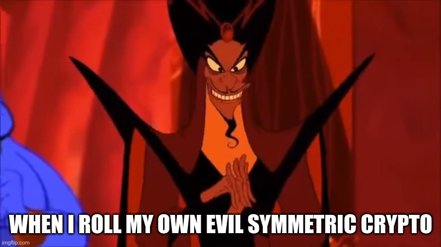

# FCSC 2025 Le retour de Jafar

Jafar est de retour avec de la crypto maléfique !

Auteur : graniter

Origine : [Le retour de Jafar](https://hackropole.fr/fr/challenges/crypto/fcsc2025-crypto-le-retour-de-jafar/)

## Challenge
[files/le-retour-de-jafar.py](files/le-retour-de-jafar.py)

-----------

## Installation manuel
Vous n'utilisez pas l'application **les CTFs de Cyrhades** ? C'est dommage !
Mais voici comment installer ce CTF manuellement :

> git clone https://github.com/Hack-Oeil/fcsc2025-crypto-le-retour-de-jafar.git

> cd fcsc2025-crypto-le-retour-de-jafar

> docker compose up

-----------

## Sur le site officiel hackropole.fr
> https://hackropole.fr/fr/challenges/crypto/fcsc2025-crypto-le-retour-de-jafar/
